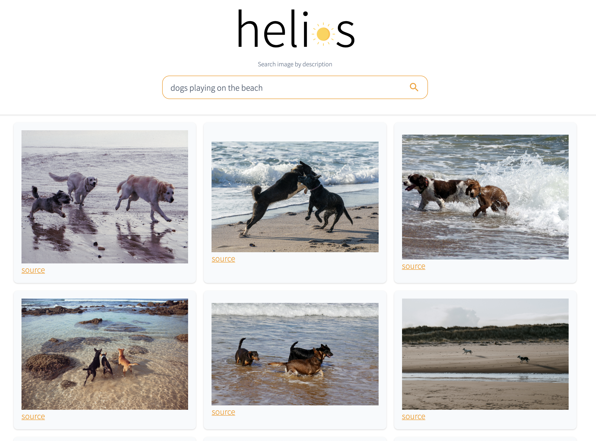

# helios

Sample implementation of natural language image search with OpenAI's [CLIP](https://github.com/openai/CLIP) and [Elasticsearch](https://github.com/elastic/elasticsearch) or [OpenSearch](https://github.com/opensearch-project/OpenSearch).



Inspired by https://github.com/haltakov/natural-language-image-search.

The goal is to build a web interface to index and search images with natural language.

The demo use [Unsplash Dataset](https://unsplash.com/data), but you are not limited to it.

## Guide: OpenSearch

### Launch the services

Make sure you have the latest version of [docker](https://www.docker.com/) installed.

```bash
docker-compose --profile opensearch --profile backend up
```

Will launch the following services:

- [OpenSearch](https://localhost:9200) // username: admin and password: admin
- [OpenSearch Dashboards](http://localhost:5601)
- [The search backend](http://localhost:8000)
- [The search frontend](http://localhost:8080/opensearch/webapp)

## Guide: Elasticsearch

### TODO

- Speed up search with [elastiknn](https://github.com/alexklibisz/elastiknn)
- Explain architecture
- Add image indexing onn the fly
- Publish scripts used to compute image features
- Write local dev guide
